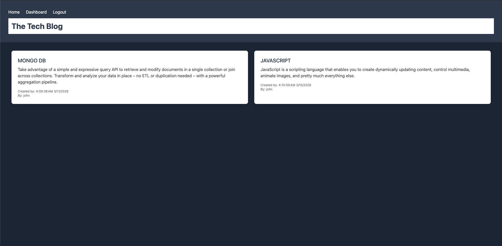

# CMS Tech Blog

## User Story
AS a developer who writes about tech I want a CMS-style blog site
So that I can publish articles, blog posts, and my thoughts and opinions.

## Description
* This site allows users to sign and create new post or make comments to existing posts relating to tech.

* Non users can only read the post and cannot comment on existing posts.

* Logged in users will be logged out if they idle on the site for too long.

## Table of Contents
- [Installation](#installation)
- [Usage](#usage)
- [How to Contribute](#how-to-contribute)
- [Questions](#questions)
- [License](#license)

## Installation
* In the root directory you want to run "npm i" to install all the required packages.

## Usage
* User can type "npm start" to start the node server. Or use "npm run watch" to use nodemon. To seed the data in the table you will want to run "npm run seed"

* This project uses bcrypt, dotenv, mysql2, connect-session-sequelize, express handlebars, express session, handlebars, express and sequelize packages.

## License
* This project is under the MIT license.
* If you want to get more details about the license, please visit [Choose License](https://choosealicense.com "Choose License")

## How to Contribute
* Feel free to contact via email or github or fork my repo and request for pull request!

## Tests
* N/A

## Questions
* Please contact me via my [Github Username](https://github.com/johnxlai)

* You can reach me with additional questions <a href="mailto:lai.john.py@gmail.com">lai.john.py@gmail.com</a>

# Screenshot

## Repo
https://github.com/johnxlai/cms-tech-blog
## Live App
https://thawing-fortress-19300.herokuapp.com/
